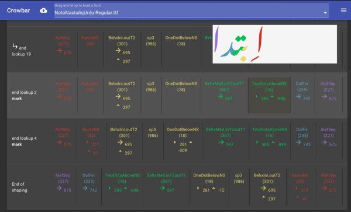

# Crowbar: A text shaping debugger

Crowbar is an application for debugging the layout tables of an OpenType font. Designers and font engineers creating OpenType fonts with a large number of layout lookups will benefit from being able to visualize the effect of these lookups on a given piece of text.

Crowbar shows the steps that an OpenType shaping/layout engine goes through as it applies feature rules from a font to an input string and turns it into a set of glyphs to be laid out visually: first, characters are mapped to glyphs, then the shaper applies all the substitution rules from the GSUB table, and then the positioning rules. In the screenshot above, you can see that the shaper has just processed lookup 2 which is part of the `mark` feature, and the result of that feature has been to reposition the `TwoDotsAboveNS` glyph.

## To use Crowbar

You can see Crowbar in action at http://www.corvelsoftware.co.uk/crowbar/

To use it, drag an OTF font to the navigation bar. Crowbar runs entirely within the browser, and does not upload the font to any server. Next, enter some text in the text box. Crowbar will display a trace of the shaping operations taken to lay out the text. As you mouse over each row in the shaping trace, Crowbar will highlight the glyphs which have changed since the previous lookup application, and visualise the effect of the operations up until the given point.

OpenType features can be specified from the drawer on the right hand side. Crowbar lists all of the features defined in your font. Clicking once on a feature name will force a feature on; clicking again will force it off; clicking a third time will restore it to the default. You can also choose the clustering level from the drawer which will affect how clusters of glyphs are coloured.

Quick tip: If you set the environment variable `FONTTOOLS_LOOKUP_DEBUGGING=1` before running fontmake, Crowbar will also tell you the name and source location of all the lookups that get processed.

## Technical details and Developing

Crowbar is a [React](https://reactjs.org) JavaScript application. It uses [harfbuzzjs](https://github.com/harfbuzz/harfbuzzjs) for shaping; Harfbuzz is the leading open source text shaping engine and is representative of how text will appear in a conforming OpenType implementation. It also uses [opentype.js](https://opentype.js.org) to extract information from the OpenType font format.

Contributions are welcome! To hack on Crowbar, you will need to:

* Clone this repository.
* Run `npm install`.
* Run `npm start` to start the server. Note that for paths to work you may need to adjust the `homepage` parameter in `package.json`.

## Roadmap

Upcoming features can be found in the Issues section. If you want to request a feature or report a bug, please add a new issue. Important upcoming features include:

* Support for variable fonts
* Display of lookups in AFDKO feature syntax

## License

This project is under an Apache license. See [LICENSE](LICENSE).
